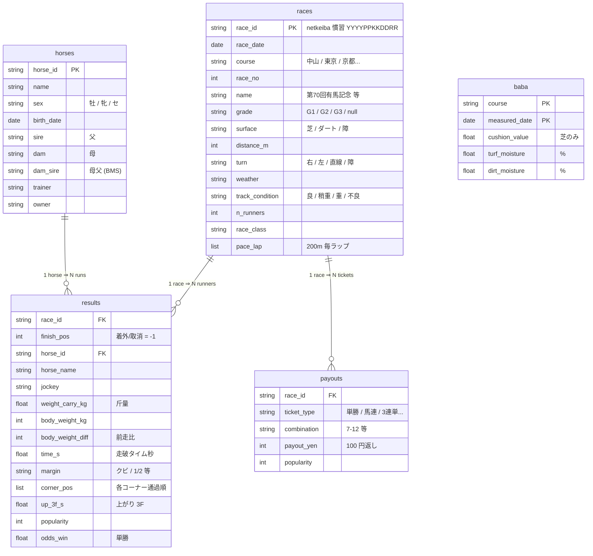

# keiba-arima-2026

年末の有馬記念に向けた競馬データ蓄積 + AI 自動 briefing。netkeiba scraper / GH Actions cron /
Parquet 蓄積 / personal-llm Worker による briefing 生成 / R2 公開 + CF Access (One-Time PIN) で
`keiba.iwachan.dev`。失敗は LINE Bot 通知。

> 役割分担: **briefing 生成** は自動・大量なので Gemini 2.5 flash (personal-llm Worker 経由)、
> **最終分析 / 馬券判断** は人間が Claude.ai web / Claude Code で briefing を読みながら行う。
> ML モデルは入れず、生データの SVG 可視化を briefing に挿す方針。

## 構成

```
src/keiba_arima/
├── config.py          # 全 env / rate-limit / scope / R2 レイアウトの集約点
├── http.py            # rate-limited httpx (8s + jitter, backoff, MAX_RETRIES で abort)
├── models.py          # races / results / horses / payouts の row dataclass
├── parsers/           # netkeiba HTML → dataclass (network に触れない純粋関数)
├── clients/           # netkeiba / jma / llm / r2 / line (class、必須 env を fail-fast)
├── store.py           # Parquet 蓄積 (race_date で year=/month= partition, keyed upsert)
├── db.py              # DuckDB read-only view (parquet glob)
├── state.py           # 取得済 id の記録 (resume 用)
├── discover.py        # scrape 対象 race_id の列挙
├── viz.py             # 生データ SVG 可視化 (着順推移 / コーナー位置取り / 人気vs着順)
├── briefing.py        # DB → context → LLM → markdown
├── publish.py         # R2 upload + index.json
├── prompts/           # briefing / review system prompt
└── jobs/              # 6 entrypoint (scrape / backfill x3 / brief x2)
worker/                # keiba.iwachan.dev フロント (CF Worker, R2 を読み配信)
terraform/             # Custom Domain + CF Access (iwachan.dev zone は core-iac の state を参照)
.github/workflows/     # cron / workflow_dispatch
```

データの真実の出所は `data/year=YYYY/month=MM/*.parquet` (commit 対象)。DuckDB は read-only view。

## データモデル



ファイル配置:

```
data/
├── year=2026/month=05/
│   ├── races.parquet
│   ├── results.parquet
│   ├── payouts.parquet
│   └── baba.parquet
├── ...
├── horses.parquet          # date 持たないので単一ファイル
└── _state/
    ├── scraped_races.json
    └── scraped_horses.json
```

各 row に `schema_version` (int) が自動付与される。`races` ↔ `baba` は course + race_date で外部 join (FK ではない)。

## 開発

```bash
make sync      # uv sync --extra dev
make test      # pytest (fixture ベースの parser/store/viz テスト)
make lint      # ruff
```

## jobs

| job | trigger | 内容 |
|---|---|---|
| `scrape-weekly` | 日曜 23:00 JST | 直近週末の全レースを取得し data/ を commit |
| `backfill-stakes` | 手動 | 過去 15 年の重賞 (G1/G2/G3) |
| `backfill-nakayama` | 手動 | 過去 10 年の中山 2500m (平場含む) |
| `backfill-horses` | 手動 | 出走馬の profile + 直近 3 年の戦績 |
| `brief-upcoming` | 日曜 23:30 / 木曜 21:00 JST | 14 日以内の重賞の事前 briefing を R2 公開 |
| `brief-review` | 月曜 01:00 JST | 直近に走った重賞の review を R2 公開 |

backfill は IP block で落ちても `data/_state/*.json` から resume できる。

## 公開フロント (keiba.iwachan.dev)

- `worker/` … R2 の `keiba/briefings/` を `<race-id>/...` として配信。`.md` は raw、`?html` で HTML 整形。
- `terraform/` … `cloudflare_workers_custom_domain` + CF Access (One-Time PIN, email allowlist)。

### deploy (cf-gateway MCP 経由)

Worker script は wrangler ではなく **cf-gateway MCP** で deploy する運用 (詳細は `terraform/README.md`):

1. `cd worker && npx wrangler deploy --dry-run --outdir dist` で単一バンドル生成
2. `prepare_deploy_upload("worker.js")` → 返った `upload_url` に bundle を PUT
3. `deploy_worker(script_name="keiba", ...)` (Duo 承認) で CF へ multipart upload
4. Custom Domain / CF Access は `terraform apply` (Custom Domain を cf_api で先行作成した場合は import)

ローカル確認だけなら `cd worker && npx wrangler dev`。友人の閲覧許可は `var.access_emails` を PR で増やす。

> 現状 (PoC): `keiba` Worker と Custom Domain `keiba.iwachan.dev` は作成済・到達確認済。
> **CF Access は未設定 = 公開状態**。実データ投入・共有の前に `terraform apply` で Access を張ること。

## 必要な secret / vars (GH Actions)

vars: `LLM_BASE_URL` (例 `https://llm.iwachan.dev`), `R2_BUCKET` (`iwachan-general`)
secrets: `LLM_URL_SECRET` `LLM_AUTH_TOKEN` `R2_ACCOUNT_ID` `R2_ACCESS_KEY_ID`
`R2_SECRET_ACCESS_KEY` `LINE_CHANNEL_ACCESS_TOKEN` `LINE_USER_ID`

## データソース (実地確認済 / event 1623)

- **netkeiba** レース結果・馬個別・最終オッズ … 実装済 (`clients/netkeiba.py`)。
- **気象庁 forecast** (千葉県北西部 = 中山) … 実装済 (`clients/jma.py`)。認証なし公開 JSON。
  `brief-upcoming` がレース当日の天気/降水確率/気温を briefing に添える。
- **JRA クッション値 / 含水率** … 実装済 (`clients/jra.py`)。`fetch-baba` (土日 cron) が `baba`
  parquet に蓄積し、`brief-upcoming` がレース競馬場の最新値を briefing に添える。
- **調教タイム** … JS 動的読み込みで静的 scrape 不可。Playwright or JRA-VAN 課金が必要なため見送り。

## 既知の TODO

- parser の CSS セレクタは netkeiba の実 DOM で要検証 (構造変更時は ParseError → LINE 通知 → fail)。
- 事前 briefing 用の出馬表 / 枠順 (shutuba) scraper は本 PR では未実装。
  scrape された結果データを briefing 入力にする配線は完成済で、shutuba parser を
  同じ store 経由で足せば `brief-upcoming` がそのまま機能する。
